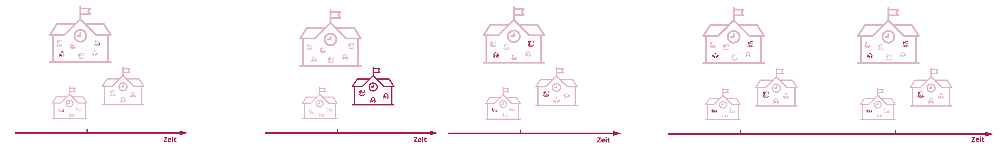
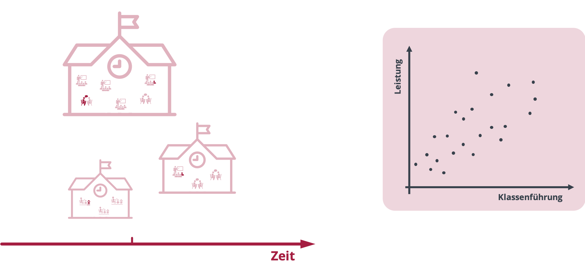
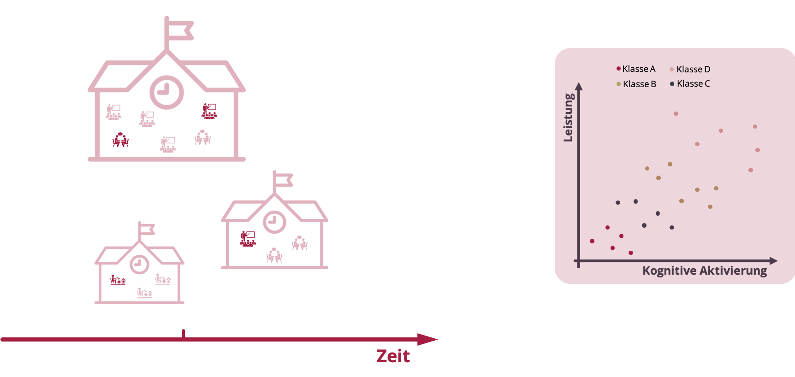
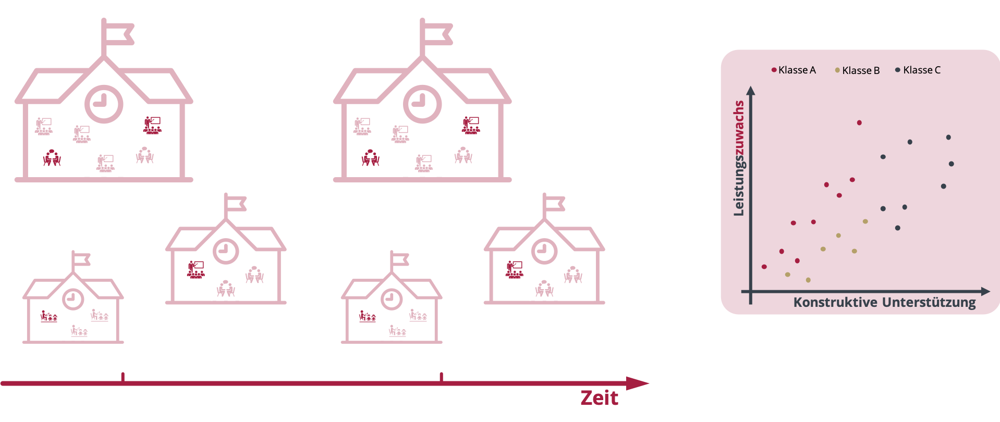
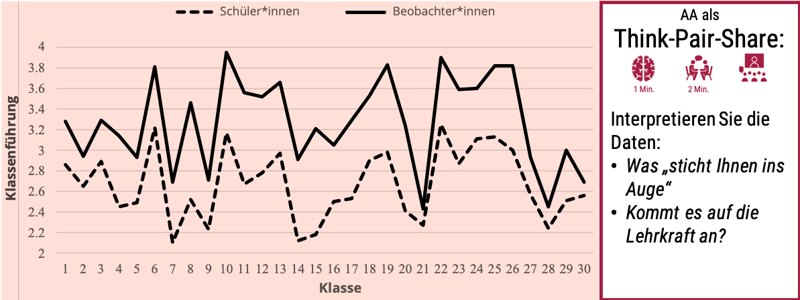
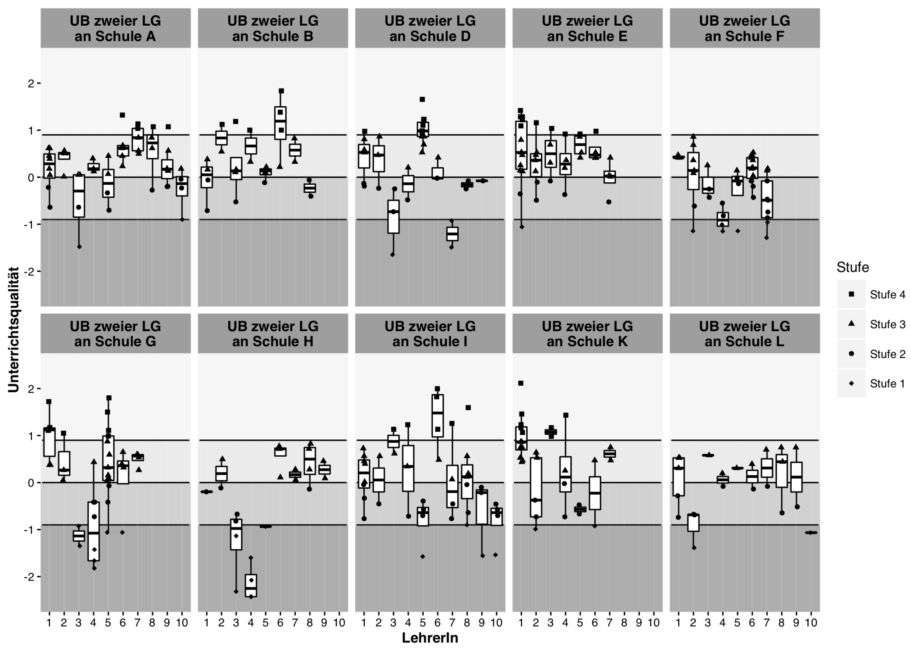

<script src="https://kit.fontawesome.com/994a28441d.js" crossorigin="anonymous"></script>
```{r setup, include=FALSE}
knitr::opts_chunk$set(echo = FALSE)
```

## {data-background=img/zitate_11_7.png data-background-size=cover}


## Überblick: Kommt es auf die Lehrkraft an?
* Aktivierung Ihres Vorwissens
  * Was verbinden Sie mit dem Begriff »Unterrichtsqualität«?
  * Ihre Meinung: Kommt es auf die Lehrkraft an?
* Definition & Verortung: »Unterrichtsqualität«
* Kommt es auf die Lehrkraft an?
  * »Besondere« Forschungsdesigns 
  * Befunde
* Zusammenfassung

<center>
<div class="top-three" font-size=7pt><span style="color:#8cd000"><font size="5pt"><p></p><p></p>
Alle Folien & deren Quellcode unter https://bit.ly/merk010 verfügbar</font></span></div>
</center>
# Aktivierung Ihres Vorwissens

## Zunächst _Ihre Auffassung/Ihr Vorwissen/Ihre Meinung:_  

<iframe src="https://embed.polleverywhere.com/free_text_polls/Gde1Xg1WXvz9pKkSBv41p?controls=presenter" width="800px" height="600px"></iframe>


<center>
<div class="top-nullfour" font-size=7pt><span style="color:#8cd000"><font size="3pt"><p></p><p></p>
Alle Folien & deren Quellcode unter https://bit.ly/merk010 verfügbar</font></span></div>
</center>

<div class="notes">
*	Sowie Sie doch sehr unterschiedliches unter Unterrichtsqualität verstehen
* Unterrichtqualität wurde in den letzten 100 Jahren natürlich unter sehr vielen verschiedenen Gesichtspunkten, Perspektiven, Konzepten betrachtet
* Das ist ja, denke ich auch plausibel, der Begriff der „Qualität“ impliziert ja, dass eine normative Dimension festgelegt werden muss, anhand derer beurteilt werden kann was gut, was besser was schlechter ist ... und gerade auch in dieser Dimension unterscheiden sich die Konzepte von Unterrichtsqualität deutlich.
* Alle Konzepte nur zu skizzieren oder eines detailliert herauszuheben macht glaube ich keinen Sinn – deshalb habe ich auf der nächsten Folie eine Gliederung dieser vielen Konzepte dargestellt.
* Diese Gliederung basiert auf einer Idee von David  Berliner
</div>

# Verortung & Definition
## Unterrichtsqualität
```{r, fig.cap="Abb. 1: Überblick Unterrichtsqualitätsforschung. Eigene Darstellung nach einer Idee von Berliner [-@berliner2005]", fig.align='center', out.width="100%"}

```

<center>
<div class="top-one" font-size=7pt><span style="color:#8cd000"><font size="3pt"><p></p><p></p>
Alle Folien & deren Quellcode unter https://bit.ly/merk010 verfügbar</font></span></div>
</center>


## Unterrichtsqualität: Definition & Kontext
<b>Eine vglw. breite Definition nach Klieme [-@klieme2019, S. 396]:</b>  
*»Unterrichtsqualität wird hier also verstanden als Gesamtheit der <span style="color:#a51e41;font-weight:bold">empirisch beobachtbaren Merkmale des Unterrichtsgeschehens</span>, die nachweislich mit der Entwicklung der Lernenden im Sinne der Realisierung von <span style="color:#8cd000;font-weight:bold">Bildungs- und Erziehungszielen</span> einhergehen.«*

Im Kontext aktueller empirischer (insb. deutschsprachiger) Forschung <i class="fas fa-eye"></i> 

* wird meistens die <span style="color:#8cd000;font-weight:bold">Leistungsentwicklung</span> als Kriterium fokussiert [@kunter2013b];
* werden meistens sog. generische Tiefenstrukturen als Unterrichtsmerkmale betrachtet [@praetorius2018]
    * <span style="color:#a51e41;font-weight:bold">Klassenführung</span> (classroom management)
    * <span style="color:#a51e41;font-weight:bold">Konstruktive Unterstützung</span> (student support)
    * <span style="color:#a51e41;font-weight:bold">Kognitive Aktivierung</span> (cognitive activation)


<div class="notes">
*positive Beziehung & wertschätzender Umgang
* Ausrichtung auf „Verstehen“ und „schlussfolgerndes Denken“
</div>

# Kurze Übung
## Übung 1
<iframe src="https://embed.polleverywhere.com/clickable_images/npkVFC0jpBlU424ap5501?controls=presenter&short_poll=true" width="800px" height="600px"></iframe>

## Übung 2
<iframe src="https://embed.polleverywhere.com/clickable_images/N7dKAEXwLuVvswlw5RoYv?controls=presenter&short_poll=true" width="800px" height="600px"></iframe>

## Übung 3
<iframe src="https://embed.polleverywhere.com/clickable_images/YPueqxWTu66rTkpQdCvrF?controls=presenter&short_poll=true" width="800px" height="600px"></iframe>

# Kommt es auf die Lehrkraft an?    


<div class="notes">Ja, jetzt haben wir also den Begriff UQ soweit geklärt, dass wir zum spannenden Punkt kommen können uns anzuschauen, wie die Empirische SuUF der Frage nachgeht & zu welchen Ergebnissen sie kommt</div>

## Kommt es auf die Lehrkraft an?
### Häufige, aber »schwache« Forschungsdesigns
* Querschnittliche Stichproben
* Querschnittliche »Klumpenstichproben«
* Längsschnittliche »Klumpenstichproben«

```{r, out.width="100%", fig.align='center', fig.cap="Abb. 3: Forschungsdesigns"}

```


## Häufige Designs: Querschnittliche Stichproben
```{r, out.width="100%", fig.align='center', fig.cap="Abb. 4: Querschnittliche Stichprobe"}

```

## Häufige Designs: Querschnittliche Klumpenstichproben
```{r, out.width="100%", fig.align='center', fig.cap="Abb. 5: Querschnittliche Stichprobe"}

```

## Häufige Designs: Längsschnittliche Klumpenstichproben
```{r, out.width="100%", fig.align='center', fig.cap="Abb. 6: Längsschnittliche Klumpenstichprobe"}

```


## Kommt es auf die Lehrkraft an?
### Häufige, aber »schwache« Forschungsdesigns
* Querschnittliche Stichproben
* Querschnittliche »Klumpenstichproben«
* Längsschnittliche »Klumpenstichproben«

$\Rightarrow$ wenig informativ zur Beantwortung der Frage »Kommt es auf die Lehrkraft an?«


## Kommt es auf die Lehrkraft an?
### Seltene Forschungsdesigns 
* Intensive Daten [z.B. @fauth2021; @meissner2020]
    * *Dieselbe Lehrer\*in unterrichtet dasselbe in verschiedenen Klassen*
* Imperfekte Hierarchien [z.B. @meissner2016; @praetorius2016; @merk2019]
    * *Beobachtung von vielen Lehrer\*innen in ihren diversen Klassen*
* Randomisierte imperfekte Hierarchien [z.B. @polikoff2015; @lei2018]
    * *Lehrer\*innen werden beobachtet und danach anderen Klassen zufallsbasiert zugeordnet*

$\Rightarrow$ informativer zur Beantwortung der Frage »Kommt es auf die Lehrkraft an?«

# Exemplarische Befunde
## Exemplarische Befunde: Intensive Daten
```{r, out.width="100%", fig.cap="Abb. 2: Mehrfach beobachtete Unterrichtsqualität einer Lehrkraft [@fauth2021]", fig.align='center'}
 ## EG: abiturma Daten
```

<!--
<center>
<div style="width:164px;"><!-- Chronme Online Stopwatch widget. -_____-><iframe src="http://www.chronme.com/index_mini.html" frameborder="0" marginwidth="0px" marginheight="0px "width="165" height="110" scrolling="no"></iframe>
<div style="font-size:0.8em; margin-top:-15px; font-family:Verdana, Arial, Helvetica, sans-serif;text-align:center;"><a style="text-decoration:none;color:#CCCCCC;" href="http://online-stopwatch.chronme.com" title="Online Stopwatch full version">online stopwatch</a></div>
</div>
</center>
-->

<center><iframe id="timerframe" src="http://www.chronme.com/index_mini.html"></iframe></center>
<style>
#timerframe { height: 100px; width: 250px; margin-top: 1cm;}
</style>

## Exemplarische Befunde: Imperfekte Hierarchie 
```{r, out.width="65%", fig.align='center', fig.cap="Abb. 3: Mehrfach beobachtete Unterrichtsqualität mehrerer Lehrkräfte [@meissner2016]"}

```


## Kommt es auf die Lehrkraft an?
### Exemplarische Befunde: Randomisierte imperfekte Hierarchie 
* Lehrerspezifische Leistungszuwächse (Teacher Added Values; TAV) korrelieren von Jahr zu Jahr nur schwach
* Kumulierte TAV prädizieren neue TAV wesentlich besser [@polikoff2015]
* Unterrichtsqualität prädiziert Added Values 
     * in Klassen in welcher sie erhoben wurde »moderat«
     * in einer zukünftigen Klasse »nur schwach« [@raudenbush2014]


# Zusammenfassung
## Zusammenfassung
* »Guter Unterricht« meistens **definiert** als Orchestrierung von »good teaching« (Inhalte, Methoden) und »effective teaching«
* »Unterrichtsqualität« meistens **operationalisiert** als mehrdimensionale Tiefenstrukturen  
* Kommt es auf die Lehrkraft an?
    * Frage nur in »starken Designs« beantwortbar
    * Eine Antwort:
        * Unterrichtsqualität i.S. eines »effective teaching« ist eine Ko-Konstruktion von Schüler\*innen und Lehrer\*innen  
        *$\Rightarrow$ Weiterentwicklung von Unterrichtsqualität ebenfalls eine Ko-Konstruktive Aufgabe* 

# Herzlichen Dank für Ihre Aufmerksamkeit!
## Literatur {.nullfuenfem}